# OrbittAPI Mobile

Cliente mobile oficial da plataforma OrbittAPI, uma SaaS de dados satelitais (NDVI, uso do solo, alagamento, desmatamento, expansão urbana) entregue via REST. O app consulta áreas, salva favoritos e acompanha mudanças, consumindo o backend Java (SOA + DDD) do repositório companheiro.

## Indústria espacial e ODS

O OrbittAPI traduz dados de satélites de observação da Terra (Landsat, Sentinel-2) em decisões cotidianas para produtores rurais, gestores ambientais e analistas de seguradora. O app também consome a NASA APOD e o EONET para reforçar a leitura espacial do planeta.

- ODS 13 (Ação contra a mudança global do clima): monitoramento de cobertura vegetal, alteração de uso do solo e rastreamento de eventos naturais via satélite.
- ODS 2 (Fome zero e agricultura sustentável): leitura de NDVI para acompanhar saúde de cultivos e identificar estresse hídrico precoce.
- ODS 9 (Indústria, inovação e infraestrutura): integração direta com infraestrutura espacial pública (NASA EONET, APOD) e backend SOA próprio.
- ODS 11 (Cidades e comunidades sustentáveis): monitoramento de uso do solo e expansão urbana orientado por dados.

## Solução completa

A entrega da Global Solution é composta por dois repositórios. Os dois precisam estar rodando para a demo funcionar de ponta a ponta.

| Repositório | Stack | Responsabilidade |
|---|---|---|
| Este repositório (`orbittapi-mobile`) | React Native, Expo SDK 55, TypeScript | App cliente em Android, iOS e Web |
| `orbittapi-backend` | Java (SOA + DDD), Docker | API REST com gateway, identity-service, satellite-service |

Link do backend: https://github.com/Lynnbrosa/GS-SOA

## Stack

- Expo SDK 55 + React Native 0.83
- TypeScript em modo strict (zero `any`)
- React Navigation v7 (Native Stack + Bottom Tabs)
- Axios para consumo do backend e das APIs públicas
- Open-Meteo para clima atual (API pública, sem chave)
- NASA APOD para foto astronômica do dia
- NASA EONET para eventos naturais rastreados por satélite
- AsyncStorage para persistência local (token, tema, favoritos, preferências)
- Context API para estado global (tema, autenticação, favoritos)
- React Native Reanimated para animações leves nos skeletons

## Como rodar tudo localmente

Em um terminal, suba o backend.

```bash
git clone https://github.com/Lynnbrosa/GS-SOA.git
cd GS-SOA
docker-compose up
```

Em outro terminal, suba o app.

```bash
git clone <link-deste-repo>
cd orbittapi-mobile
cp .env.example .env
npm install
npx expo start
```

Na tela do Expo, tecle:

- `a` para Android (emulador ou dispositivo via Expo Go)
- `i` para iOS (apenas macOS)
- `w` para Web

## Pra avaliador / professor

Resumo objetivo do que esperar:

1. **Subir o backend** (`docker-compose up` no repo [GS-SOA](https://github.com/Lynnbrosa/GS-SOA)). O gateway sobe na 8080, identity na 8081, satellite na 8082.
2. **Copiar `.env.example` para `.env`** e rodar `npm install` neste projeto. A `.env.example` já vem com a chave NASA preenchida e `EXPO_PUBLIC_API_URL=http://localhost:8080`.
3. **`npx expo start`** e escolher uma plataforma.

Por plataforma:

- **Android** (recomendado): o app detecta automaticamente que está em emulador e troca `localhost` por `10.0.2.2` na chamada do backend. Não precisa mexer em nada. Em dispositivo físico via Expo Go, troque `EXPO_PUBLIC_API_URL` pelo IP da máquina hospedeira na mesma Wi-Fi (por exemplo `http://192.168.0.10:8080`).
- **iOS** (simulador macOS): `localhost:8080` funciona direto.
- **Web** (`npx expo start --web`): o backend não envia headers CORS, então o browser bloqueia chamadas autenticadas com 403. Pra avaliar a UI no web sem subir o backend, defina `EXPO_PUBLIC_USE_MOCK=true` no `.env`. As capturas de tela em [assets/screenshots/](assets/screenshots/) foram feitas via Web com a integração real.

Tudo que vem do backend SOA (auth, landuse, vegetation, me) e tudo que vem das APIs públicas (Open-Meteo, NASA APOD, NASA EONET) está adaptado por adapters em `src/services/`. Não há código a modificar.

## Variáveis de ambiente

Arquivo `.env` (use `.env.example` como referência):

| Variável | Descrição | Default |
|---|---|---|
| `EXPO_PUBLIC_API_URL` | Base URL do gateway do backend | `http://localhost:8080` |
| `EXPO_PUBLIC_USE_MOCK` | Se `true`, usa dados sintéticos no lugar do backend (apenas para desenvolvimento isolado) | `false` |
| `EXPO_PUBLIC_NASA_KEY` | Chave da API da NASA (apod + eonet). O `.env.example` já vem com uma chave válida; `DEMO_KEY` também funciona porém tem cota baixa (30 req/h) | chave do `.env.example` |

Em **emulador Android**, o app já remapeia `localhost` para `10.0.2.2` automaticamente; não é necessário ajustar o `.env`. Em **dispositivo físico**, troque por `http://<IP-da-máquina>:8080` na mesma rede Wi-Fi.

## Telas

Imagens em `assets/screenshots/`.

| Tela | Light | Dark |
|---|---|---|
| Login | 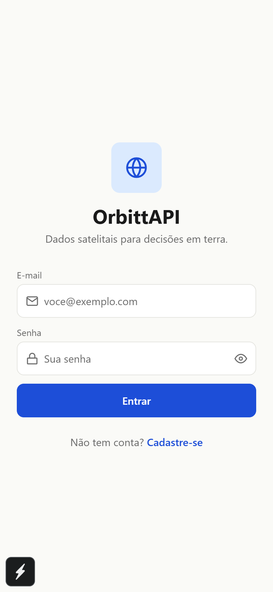 | 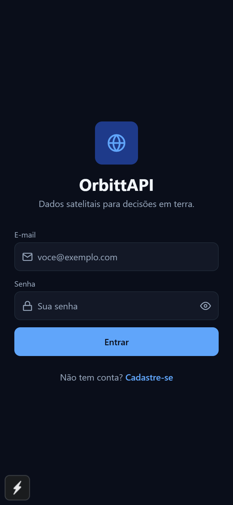 |
| Cadastro | 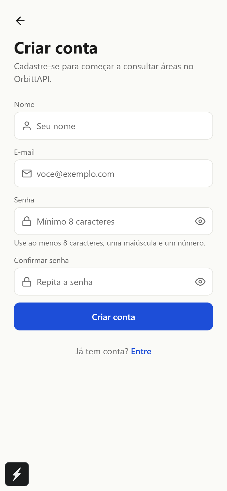 | 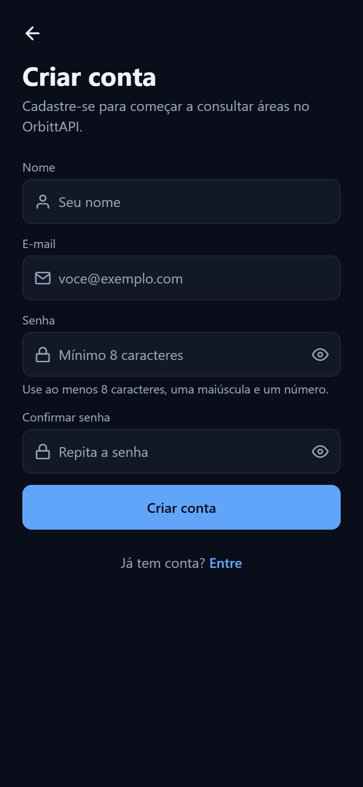 |
| Home | 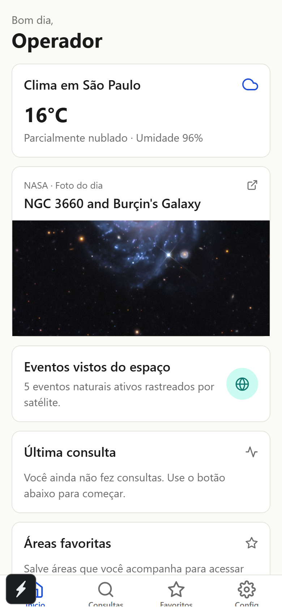 | 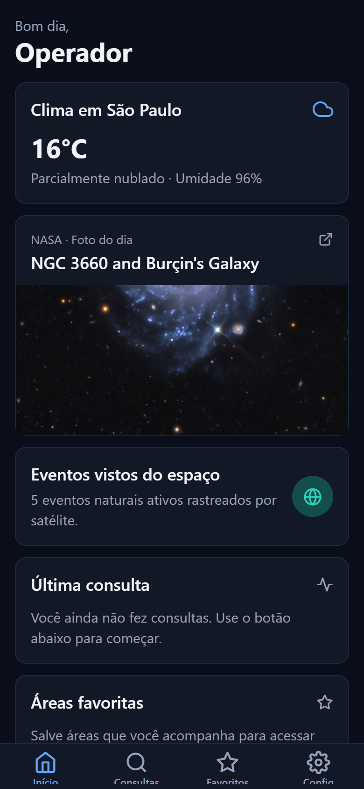 |
| Consultas | 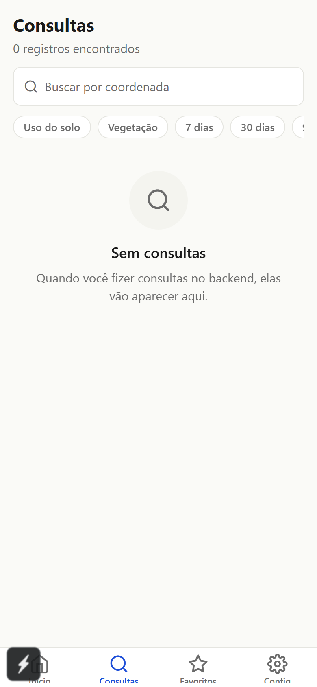 | 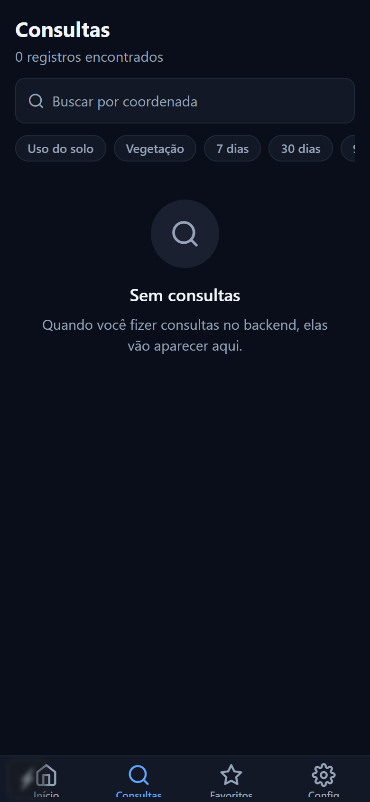 |
| Detalhe da consulta | 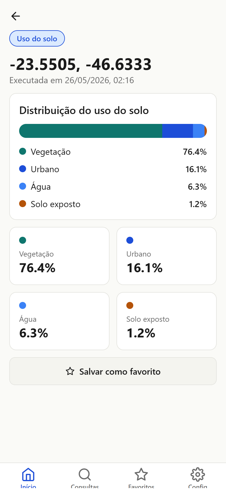 | 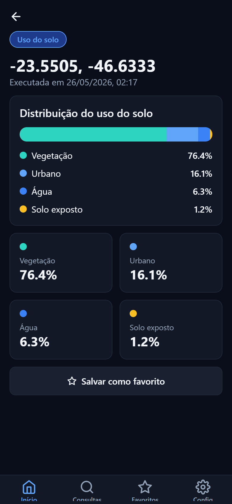 |
| Favoritos | 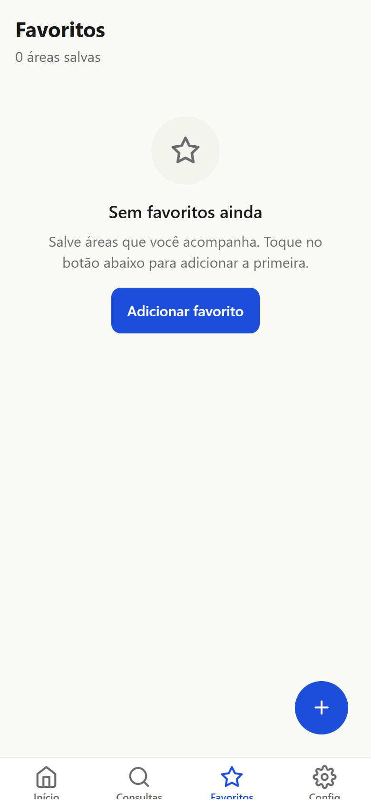 | 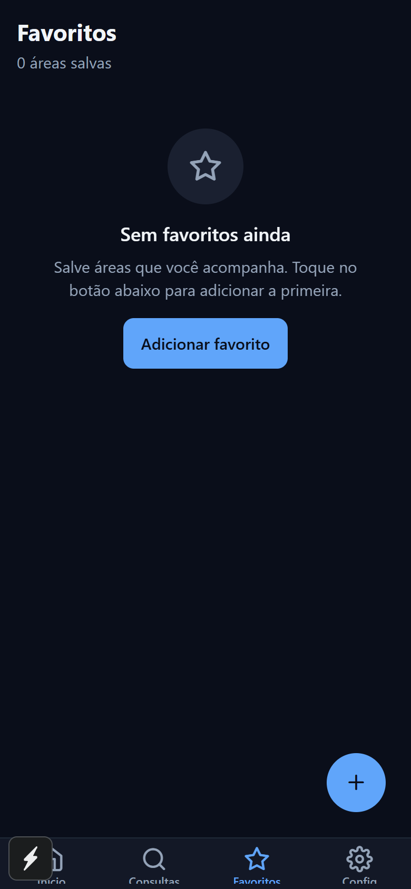 |
| EONET (eventos vistos do espaço) | 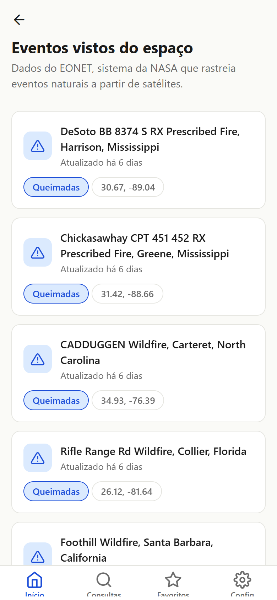 | 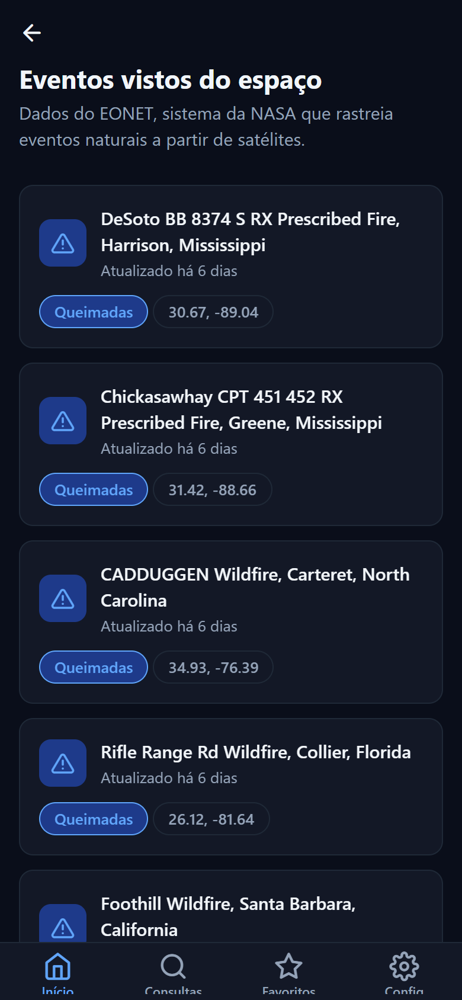 |
| NASA APOD (foto astronômica do dia) | 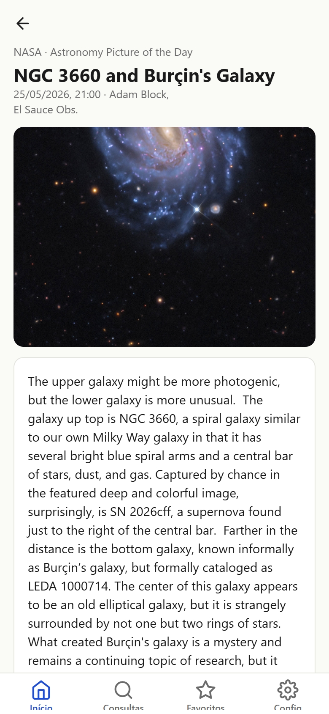 | 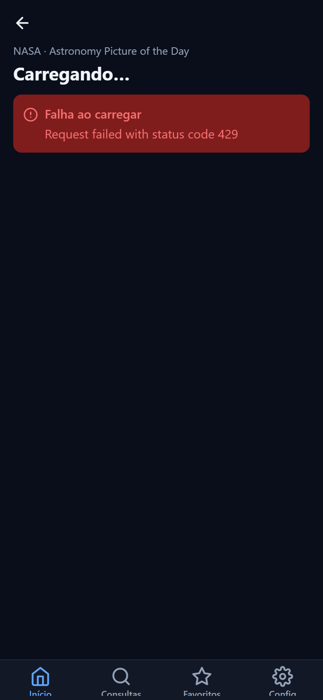 |
| Configurações | 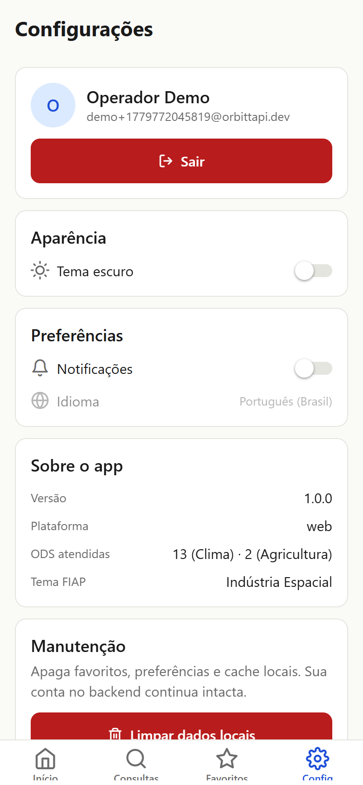 | 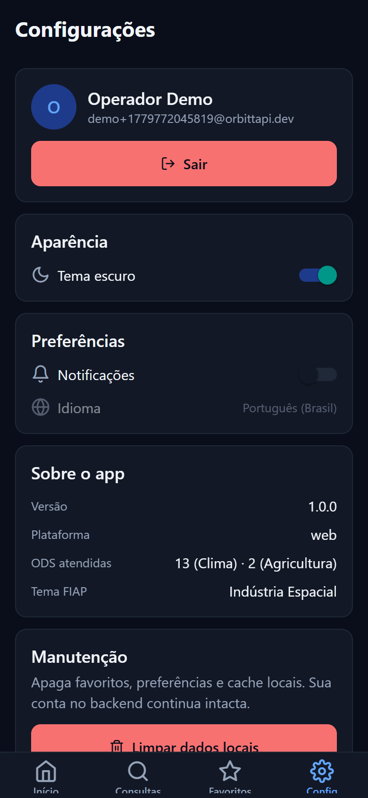 |

## Estrutura de pastas

```
src/
  components/      # Card, Button, Input, Skeleton, EmptyState, Header, Chip, CoordinateInput, Alert
  screens/
    auth/          # LoginScreen, RegisterScreen
    main/          # HomeScreen, QueriesScreen, FavoritesScreen, SettingsScreen,
                   # NewQueryScreen, NewFavoriteScreen, QueryDetailScreen,
                   # EventsScreen, ApodScreen
  navigation/      # RootNavigator, AuthStack, MainTabs, HomeStack, FavoritesStack, QueriesStack, types
  services/        # api (axios), auth, satellite, weatherApi, nasaApi, mockApi
  hooks/           # useTheme, useAuth, useFavorites, useApi, useQueries
  contexts/        # ThemeContext, AuthContext, FavoritesContext
  storage/         # keys, asyncStorage
  types/           # tipos compartilhados (Account, Coordinate, NdviResult, ApodPicture, SpaceEvent, ...)
  theme/           # colors, spacing, typography
  utils/           # formatters, validators
App.tsx
app.json
tsconfig.json
.env.example
```

## Funcionalidades implementadas

- [x] Cadastro e login contra o backend SOA, com token JWT persistido em AsyncStorage
- [x] Logout limpa token e volta para o AuthStack
- [x] Tema claro/escuro com toggle persistente e detecção do sistema na primeira execução
- [x] Home com saudação dinâmica, clima real (Open-Meteo), foto do dia (NASA APOD), eventos vistos do espaço (NASA EONET), última consulta, favoritos recentes e indicador de cota
- [x] Tela dedicada para APOD com imagem em alta resolução e explicação completa
- [x] Tela dedicada para eventos naturais rastreados por satélite (EONET) com filtro de categorias e link externo
- [x] Histórico de consultas persistido em AsyncStorage, paginado, com filtros por endpoint, janela de tempo, busca e ordenação
- [x] Tela de detalhe de consulta com barra empilhada para uso do solo e escala visual para NDVI
- [x] Favoritos com adição, edição inline, remoção (long press e botão), persistência local e botão "Consultar agora e salvar"
- [x] Settings com card de conta, toggles de tema e notificações, seção sobre o app e ação destrutiva de limpar dados locais
- [x] Interceptor Axios que injeta Bearer token, parseia erros RFC 7807 e desloga automaticamente em 401
- [x] Validação inline de e-mail, senha forte e coordenadas
- [x] Skeleton, EmptyState e pull-to-refresh em todas as listas
- [x] TypeScript strict, sem `any`

## Mapa de critérios do enunciado

| Critério | Peso | Onde está |
|---|---|---|
| Estrutura do Projeto | 1.0 | `src/` segue exatamente o enunciado (components, screens, navigation, services, hooks, contexts, storage, types, theme, utils, assets) |
| React Native + TypeScript | 1.0 | Hooks customizados, componentização (`components/`), strict mode sem `any`, tipos compartilhados em `types/` |
| Navegação | 0.5 | Bottom Tabs + Native Stack v7 com `RootParamList` tipado e composite props |
| Consumo de API | 1.5 | 4 APIs: backend SOA, Open-Meteo, NASA APOD, NASA EONET — Axios com interceptors e tratamento RFC 7807 |
| Persistência Local | 1.0 | AsyncStorage com wrappers tipados em `storage/asyncStorage.ts` para token, tema, favoritos e preferências |
| Interface (UI/UX) | 2.0 | Design tokens, dark mode automático, skeleton loading, empty states, pull-to-refresh, gráficos custom (NDVI scale, stacked bar) |
| Funcionalidades | 1.5 | Home dashboard, listagem com filtros/busca/ordenação/paginação, favoritos CRUD, consultas reais, EONET, APOD |
| Código e Boas Práticas | 0.5 | Service layer, hooks reutilizáveis, separação clara de responsabilidades, zero `console.log` |
| Criatividade e Inovação | 1.0 | NASA APOD + EONET (sensoriamento remoto da própria NASA), NDVI com escala visual, integração direta com backend SOA |

## Diferenciais

- Detecção do esquema do sistema operacional na primeira execução, sobreposta pela preferência salva
- Tratamento padronizado de `application/problem+json` (RFC 7807) com mensagens legíveis em PT-BR
- Fallback de mock controlado por variável de ambiente, sem reescrever serviços
- Visualização de NDVI com escala de cores e descrição automática do nível de cobertura
- Integração com a NASA (APOD para o dia atual, EONET para eventos naturais ativos em todo o planeta) para reforçar a leitura espacial do projeto

## Integrantes

Giovanne Charelli Zaniboni Silva — RM 556223
Leonardo Pasquini Baldaia — RM 557416
Gustavo Oliveira de Moura — RM 555827
Lynn Bueno Rosa — RM 551102
